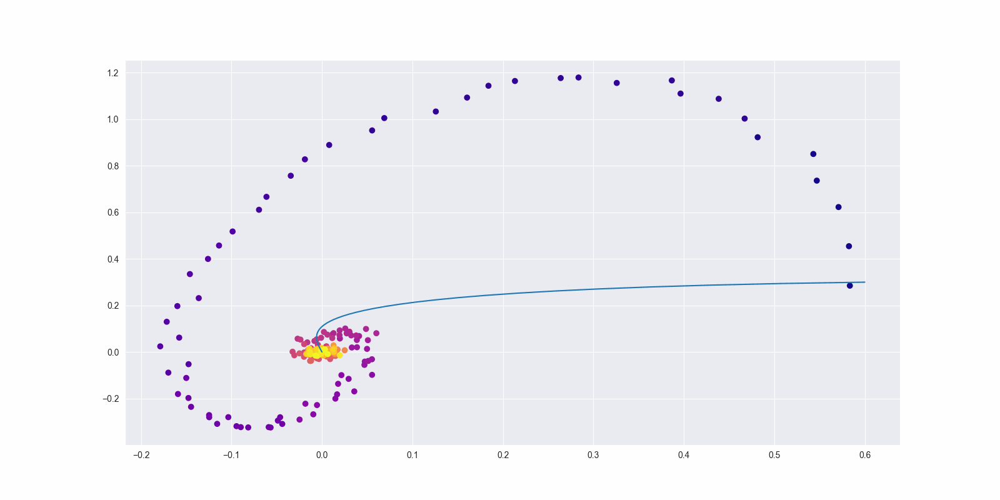

# Лабораторная работа по ДУ

## Задание
(10) Нахождение параметров (значений коэффициентов) линейного дифференциального уравнения с постоянными коэффициентами при известных значениях в ряде точек.

## Выполнение
Была выбрана система уравнений:
```
x' = 1/5 * y
y' = 2x - 1/2 * y
```

## Численное решение
С использованием метода NeuralODE были найдены значения коэффициентов при известных значениях в ряде точек.

Процесс обучения в виде динамического графика:




Найденные значения коэффициентов:
```
[[ 1.5477e-03, -2.0322e-01],
[ 1.8768e+00, -4.7752e-01]]
```

Полученная точность - 0.02

В файле `main.py` реализована простая версия NeuralODE из статьи [Neural Ordinary Differential Equations](https://arxiv.org/abs/1806.07366)  

## Выводы
Метод NeuralODE позволяет находить значения коэффициентов линейного дифференциального уравнения с постоянными коэффициентами при известных значениях в ряде точек с достаточно высокой точностью.
